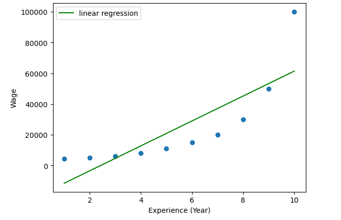
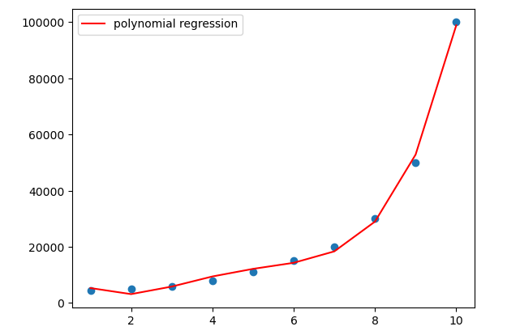

# Polynomial_Linear_Regression-Pay-Scale
<h2>Polynomial Linear Regression</h2>

<h3>Applying Polynomial Regression</h3>

The reason behind the wide use cases of polynomial regression is that almost all real-world data is inherently non-linear, and so when we fit a non-linear model or a curvilinear regression line to the data, the results we get occur. The results we get are much better than what we can get with standard linear regression. Here are some of the use cases of polynomial regression:

- The growth rate of tissues.
- Progress of disease outbreaks
- Distribution of carbon isotopes in lake sediments

The main purpose of regression analysis is to model the expected value of the dependent variable y based on the value of the independent variable x.

<h4>Application Made</h4>

Your data points clearly do not fit a linear regression (a straight line through all data points) so polynomial regression was used.

Polynomial regression, like linear regression, used the relationship between x and y variables to find the best way to draw a line through data points.

- Polynomial Linear Regression General Formula:

<b> y = a + b1*x + b2*x^2 + b3*x^3 + b4*x^4 + ....... + bN*x^N<b>

